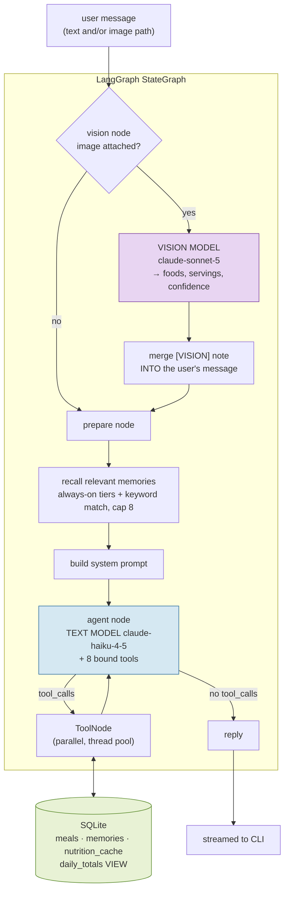

# CalorAI Agent

A conversational meal logger you talk to like a friend. Text what you ate, send a
photo of your plate, correct yourself halfway through — it keeps an accurate
running total of your day. No forms, no dropdowns.

```
you: had 2 parathas and chai for breakfast
calorai: Logged 2 parathas and chai — 610 cal, 12.5g protein. That puts you at 610 cal today.

you: actually that was 3 parathas
calorai: Fixed — 3 parathas and chai, 870 cal. You're at 870 cal today.

you: how much protein have I had?
calorai: You're at 17.5g protein today.
```

That second message is the whole product in miniature: it **edits the existing
row**. The day shows 870, not 610 + 870.

## Contents

- [Project Overview](#project-overview)
- [Setup / Installation](#setup--installation)
- [Model Choices](#model-choices)
- [Memory Design](#memory-design)
- [Tool Design](#tool-design)
- [Latency Numbers](#latency-numbers)
- [Architecture](#architecture)
- [Test Cases](#test-cases)
- [Assumptions and Trade-offs](#assumptions-and-trade-offs)
- [Time Breakdown](#time-breakdown)
- [What I'd Build Next](#what-id-build-next)
- [AI Tools Used](#ai-tools-used)

---

## Project Overview

CalorAI is a WhatsApp-style calorie tracker built as a LangGraph agent over
SQLite. A user texts what they ate in whatever shape it comes out — "leftover
biryani, maybe two thirds of the box", "same as yesterday", a photo of a plate
with "half of this was my brother's" — and the agent decides whether it has
enough to log, asks one short question when it doesn't, and maintains running
daily totals that stay correct through edits and deletions. Two models are used
deliberately: a fast, cheap one for conversation and tool calling, and a stronger
one for recognising food in photos. Preferences, goals, and recurring meals
persist as durable memories that survive restarts and get selectively injected
into the prompt each turn.

---

## Setup / Installation

```bash
git clone https://github.com/Parthjain171/calorai-agent.git
cd calorai-agent

python -m venv .venv
source .venv/bin/activate         # Windows: .venv\Scripts\activate
pip install -r requirements.txt

cp .env.example .env              # Windows: copy .env.example .env
```

Then put a key in `.env`. **The default configuration runs on Groq's free tier**
(no card) — create a key at [console.groq.com/keys](https://console.groq.com/keys):

```ini
OPENAI_API_KEY=gsk_...your-groq-key...
OPENAI_BASE_URL=https://api.groq.com/openai/v1
TEXT_MODEL=openai/gpt-oss-20b
VISION_MODEL=qwen/qwen3.8-27b
NUTRITION_MODEL=openai/gpt-oss-20b
```

This is the configuration every real-model number in this README was measured
on. The provider is inferred from the model id and base URL, so any of these
work by editing `.env` alone — no code change. `.env.example` has a ready
block for each:

| Provider | Free? | Env | Status |
|---|---|---|---|
| Groq | **Yes, free tier** | `OPENAI_API_KEY` + `OPENAI_BASE_URL` | **Verified end to end** |
| Google Gemini | Yes, free tier | `GOOGLE_API_KEY` | Wired and tested to the API; see note |
| Anthropic | Paid | `ANTHROPIC_API_KEY` | Wired; client constructs, no paid run |
| OpenAI / GitHub Models / OpenRouter / Ollama | Paid / free / local | `OPENAI_API_KEY` (+ `OPENAI_BASE_URL`) | Same client as Groq |

Gemini note: the integration is complete and the key authenticates, but Google
returned `403 PERMISSION_DENIED: Your project has been denied access` for every
model on the account used to build this — a restriction Google applies to some
new accounts, unrelated to the code. If your account is not restricted, the
Gemini block in `.env.example` should work as is.

Whatever you pick, the text and vision paths stay two **different** models.

Run it:

```bash
python cli.py                                    # interactive chat
python cli.py --user parth                       # a separate, isolated log
python cli.py -m "had 2 rotis and dal"           # one-shot
python cli.py --image assets/sample_plate.png -m "half was my brother's"
python cli.py --latency                          # p50/p95 report
```

In-chat: `/img <path> [caption]`, `/totals`, `/meals`, `/memories`, `/latency`,
`/reset`, `/help`, `/quit`.

See all 11 required conversations work, top to bottom, with the database shown
after every turn:

```bash
python demo.py
```

Run the tests and the eval set:

```bash
pytest                                           # 36 unit tests, no network
python eval/eval_runner.py                       # all 11 cases, DB-asserted
python eval/eval_runner.py --case 05 09 -v       # just the differentiators
python eval/eval_runner.py --repeat 10           # more latency samples
python eval/test_eval_detects_regressions.py     # proves the eval can fail
```

The same four commands run in CI on every push
([`.github/workflows/ci.yml`](.github/workflows/ci.yml)), on Python 3.11 and 3.12.

Optional: a free [USDA FoodData Central key](https://fdc.nal.usda.gov/api-key-signup.html)
in `USDA_API_KEY` adds measured nutrition data for foods outside the seed table
(see [Tool Design](#tool-design)).

**No API key?** `CALORAI_MOCK=1` swaps in a deterministic scripted stand-in for
the conversation model, so the whole suite runs offline. It validates plumbing —
tools, database, state transitions — **not** answer quality. See
[Latency Numbers](#latency-numbers) for what that does and does not tell you.

```bash
CALORAI_MOCK=1 python eval/eval_runner.py       # macOS / Linux
```
```powershell
$env:CALORAI_MOCK=1; python eval\eval_runner.py  # Windows PowerShell
```

Env-var syntax elsewhere in this README is bash; on PowerShell use
`$env:NAME='value'` on its own line first.

Only one key is needed — whichever provider block you filled in above.

---

## Model Choices

The split matters more than the specific vendor: **a small fast model for
conversation and tool calling, a stronger one for recognising food in photos.**
That holds across every supported provider.

**Default (free tier, verified) — Groq:**

| Path | Model | Why |
|---|---|---|
| Conversation + tool calling | `openai/gpt-oss-20b` | Correct tool calls on every test turn; ~0.6 s per call unthrottled. Runs on ~90% of turns. |
| Vision (food recognition) | `qwen/qwen3.8-27b` | The only current Groq family that accepts images; clean JSON output (its 3.6 sibling leaks `<think>` blocks). |
| Nutrition estimation | `openai/gpt-oss-20b` | On the critical path, emits ~200 tokens of JSON. Rarely called (see caching). |

Chosen by measurement, not by reputation. Groq's lineup for a free key was
listed live (`/models`), then every candidate was probed: three models make
correct tool calls (`gpt-oss-20b` 0.5 s, `gpt-oss-120b` 3.3 s, `qwen3.8-27b`
0.4 s), two accept images (both qwen), and `gpt-oss` is text-only. `gpt-oss-120b`
alone would have consumed the 3 s turn budget on a single call. `gpt-oss-20b`
runs with `reasoning_effort=low` — hidden reasoning tokens are wasted on "which
tool, with what arguments", and they count against the free tier's per-minute
budget.

The two model families are deliberately different: gpt-oss cannot see, qwen
can, and each does the job it is best at.

**Alternative (free tier) — Google Gemini:** `gemini-3.5-flash-lite` for text,
`gemini-3.5-flash` for vision, one `GOOGLE_API_KEY`. Fully wired; see the account
restriction note under Setup.

**Paid equivalent — Anthropic** (the original configuration):

| Path | Model | Price /MTok | Why |
|---|---|---|---|
| Conversation + tool calling | `claude-haiku-4-5` | $1 in / $5 out | Fastest and cheapest tool-caller in the family. |
| Vision (food recognition) | `claude-sonnet-5` | $2 in / $10 out | Materially better at identifying food and judging portions. |

The brief suggested Claude 3.5 Sonnet / GPT-4o-mini for text and GPT-4o /
Claude 3.5 Sonnet for vision. Those all still work — `TEXT_MODEL=gpt-4o-mini
VISION_MODEL=gpt-4o` with an `OPENAI_API_KEY` — but the newer models in the same
tiers are cheaper, faster, and better at tool calling.

**Why two models rather than one.** The two jobs have opposite cost profiles.
Conversation and tool orchestration are *easy* — decide which tool, fill in
arguments, write one friendly sentence — and they happen on every single message,
so latency and cost dominate. Identifying dal versus rajma from a photo is
*hard*, and happens on a small minority of turns, so quality dominates and the
price difference is bounded by how rarely it runs. Routing everything through one
model means either paying vision-grade prices on every "how am I doing?" or
accepting weak food recognition. Splitting also isolates failures: a vision
timeout degrades to "what was in the photo?" instead of taking down logging.

**The handoff, concretely.** A photo does not reach the conversation model as an
image. The vision node calls the vision model, which returns JSON only — foods,
servings, confidence, and a confirming question if unsure. That is rendered as a
`[VISION]` note and **merged into the user's own message**, so the text model
reads the caption and the identified food together in one turn. That merge is
what makes case 9 work: "1x biryani" plus "half of this was my brother's"
resolves to one meal at 0.5 servings rather than a photo meal and a caption meal.
Low confidence is passed through rather than hidden, so the agent asks "looks
like rice and dal — is that right?" instead of guessing.

---

## Memory Design

The most important part of the system, and the part most easily done badly.
Memory here is **not** conversation history — it is a small set of durable facts
that should still be true next month.

### What gets stored

| Category | Example | Retrieval |
|---|---|---|
| `preference` | vegetarian; allergic to peanuts | **always injected** |
| `goal` | 140g protein per day | **always injected** |
| `usual_meal` | usual breakfast = 2 idli and sambar | **always injected** |
| `habit` | skips lunch on weekdays | keyword-matched |
| `fact` | anything else worth keeping | keyword-matched |

The first three tiers are always injected because there are only a handful per
user, they change the answer *even when the message doesn't mention them*, and
getting them wrong is the visible failure — suggesting chicken to a vegetarian is
worse than any amount of latency. The other two are where volume accumulates, so
they must earn their place in the prompt.

### What is deliberately NOT stored

Individual meals (those are rows in `meals`), moods, one-off remarks, and
anything you wouldn't want repeated back in three weeks. Auto-summarising every
turn into memory is what produces the "remembers that you said hi on Tuesday"
failure mode, so the `store_memory` tool description is mostly a list of what not
to keep.

### When it writes

Writes are **model-driven**: the model recognises a durable fact and calls
`store_memory` in the same turn, without ceremony. "i'm vegetarian btw" stores
`diet = vegetarian` and logs no meal. There is no background summarisation pass —
that would be a second inference on every turn, for facts that appear a handful
of times in a user's lifetime.

### How it retrieves

Retrieval runs in the graph's `prepare` node, against the incoming message,
*before* the model sees anything:

1. Take all `preference` / `goal` / `usual_meal` memories.
2. Score the rest by token overlap with the user's message, ignoring stopwords,
   with a small bonus for frequently-used memories so a daily habit outranks a
   fact mentioned once.
3. Keep the always-on tier plus anything scoring above zero, capped at
   `CALORAI_MAX_MEMORIES` (default 8).
4. Mark what was surfaced (`last_used`, `use_count`) — that feeds step 2 next time.

`recall_memory` exists as a tool on top of this for the case injection can't
cover: "my usual" needs the *exact stored value* to act on, not a hint.

### How it avoids bloating context

Three layers rather than one, because any single layer fails eventually:

1. **Write-side selectivity** — only five categories are storable, and the tool
   description steers hard against keeping chatter.
2. **Keyed upsert** — `UNIQUE(user_id, key)`. Saying "I'm vegetarian" ten times
   yields one row, not ten. Restating a goal overwrites it.
3. **A hard cap** — at most 8 memories reach any prompt, ranked by tier then
   relevance then recency. Even a user with 500 memories has a bounded prompt.

### Persistence

Memories live in SQLite, so they survive process restarts, and they are scoped by
`user_id`. The eval asserts this: case 10 stores a "usual breakfast" and a later
turn resolves "my usual" against it through a fresh agent instance.

**Known limitation:** relevance is lexical token overlap, not embeddings. "what
can I eat" will not retrieve a memory phrased "avoids dairy". The always-injected
tiers are what keep this from mattering for the facts that actually matter; see
[What I'd Build Next](#what-id-build-next).

---

## Tool Design

Eight tools, split so that no two can do the same job. The rule of thumb: one
tool per *state transition*, and reads separated from writes.

| Tool | Does | Boundary |
|---|---|---|
| `lookup_nutrition` | Macros for a **list** of foods, scaled by servings | Pure read, no DB writes. Never logs. |
| `log_meal` | Insert a **new** meal | Only for food not yet recorded. |
| `get_meals` | Retrieve meals by date range / name fragment | The only way to find a `meal_id`. |
| `update_meal` | Edit an existing meal **in place** | The only path for corrections. |
| `delete_meal` | Remove a meal entirely | Points corrections back at `update_meal`. |
| `get_daily_totals` | Calories + macros for one day | Reads the SQL view, never estimates. |
| `store_memory` | Save a durable fact | Never stores meals. |
| `recall_memory` | Look up stored facts | Read-only. |

Design decisions worth defending:

- **`log_meal` vs `update_meal` is the sharpest boundary in the system.** Using
  `log_meal` to fix an existing meal double-counts the day, and it fails
  *silently* — no error, just wrong numbers. Both tool descriptions call this out
  explicitly, and the eval asserts it.
- **`lookup_nutrition` takes a list, not one food.** "2 parathas and chai" needs
  two lookups; batching them into one call saves a full model round-trip per
  extra food, and lets the estimator resolve every cache miss in a single
  request. It returns a combined `total` that can be passed straight to
  `log_meal`.
- **`log_meal` returns the updated daily totals.** The most common reply is
  "logged it, here's where you stand", so folding totals into the write removes a
  second tool call from the hottest path.
- **`get_meals` has `name_contains`.** Corrections need to find "the rotis"
  without a separate search tool, which would have overlapped with `get_meals`.
- **`user_id` is never a tool argument.** It travels out-of-band in a
  `contextvars.ContextVar` set per turn. The model cannot pick whose data it
  touches, and the schemas stay about food.

### The nutrition lookup, in four tiers

Cheapest first, because most food is boring and repeated:

1. **Seed table** — ~70 foods Indian users actually text about, in-process. ~0 ms,
   zero tokens. Handles most eval traffic.
2. **SQLite cache** — anything a lower tier has resolved before, on any past run.
   Survives restarts.
3. **USDA FoodData Central** — measured data for foods the seed table lacks.
   One HTTP call per unknown food, fanned out concurrently, then cached, so each
   distinct food costs one request ever. Generic datasets only (FNDDS,
   Foundation, SR Legacy — never branded products), and a hit must contain every
   token of the query, so "chai" can never resolve to "Chard, cooked". Optional:
   off unless `USDA_API_KEY` is set. `DEMO_KEY` works but is capped at
   **10 requests/hour** (measured from the `X-Ratelimit-Limit` header, not the
   30 the docs suggest), so a circuit breaker stands the tier down for 15 min
   after a 429 rather than paying a dead round-trip on every miss.
4. **LLM estimator** — one batched call for whatever no database lists, then
   cached.

If the estimator is unreachable too, a coarse keyword heuristic produces a
number anyway. In a texting UX a roughly-right calorie count that gets logged
beats an error message.

---

## Latency Numbers

Two things are measured and reported separately: what the models cost, and
what the harness around them costs. All real-model numbers are from the
verified Groq configuration (`gpt-oss-20b` text, `qwen3.8-27b` vision) on its
**free tier**, which matters for reading the tails — see below.

### Measured: real models

From `python eval/eval_runner.py --pace 50` over the nine text cases (10 turns,
30 model calls) plus the two photo cases run against a real plate photo:

| Span | n | p50 | p95 | mean | max |
|---|---|---|---|---|---|
| `text_model_call` | 30 | **0.66 s** | 13.8 s | 1.90 s | 19.6 s |
| `turn_text` (end to end) | 10 | **1.77 s** | 26.5 s | 6.19 s | 26.5 s |
| `vision_model` | 2 | 2.0 s (warm) | — | — | 11.8 s (first call) |
| `turn_image` (end to end) | 2 | **4.4 s** (warm) | — | — | 14.7 s (first call) |

**Text turns land at 1.8 s p50 against a 3 s target; image turns at 4.4 s
against 6 s.** A model call unthrottled is 0.4–0.8 s, and a turn is two or
three of them: decide → tool(s) → reply.

**The p95 is the free tier, not the model.** Groq meters `gpt-oss-20b` at
8,000 tokens per minute (`x-ratelimit-limit-tokens: 8000`, read from the
response headers). A turn arriving inside the same minute as the previous one
is refused with a 429 and the SDK's backoff wait — 15–24 s per call — is what
gets recorded. The `--pace` flag exists to separate the two: paced runs measure
inference, unpaced runs measure the tier. Three of the ten turns above were
still throttled even at 50 s pacing. There is no free Groq model with a bigger
budget that supports custom tools (`compound-mini` has 70k TPM but rejects the
`tools` parameter), so on a paid tier or a different provider this tail simply
disappears; the inference numbers do not change.

**The vision first-call penalty** (11.8 s once, then 2.0 s) is a warm-up on the
provider side: both requests carried the same 78 KB downscaled JPEG.

### Measured: framework overhead

Everything except the model calls — graph traversal, memory retrieval, tool
execution, SQLite reads and writes, response assembly. From 10 full eval passes
(`CALORAI_MOCK=1`), n=100 text turns / n=30 image turns:

| Span | n | p50 | p95 | max |
|---|---|---|---|---|
| `turn_text` (end to end) | 100 | 0.03 s | 0.05 s | 0.09 s |
| `turn_image` (end to end) | 30 | 0.03 s | 0.07 s | 0.09 s |
| `text_model_call` (harness only) | 360 | 0.00 s | 0.00 s | 0.05 s |
| `vision_model` (harness only) | 30 | 0.00 s | 0.00 s | 0.00 s |

So the harness contributes **~30 ms at p50 and ~70 ms at p95**. Against a 3 s text
budget that is ~2%, which means essentially the entire real-world budget is model
time, and optimisation effort belongs there rather than in the graph.

Reproduce either table:

```bash
python eval/eval_runner.py --pace 50    # real model, paced under the tier
python cli.py --latency                 # p50/p95 across every run, from data/latency.jsonl
```

The instrumentation records nested spans (`turn_text` / `turn_image` contain
`vision_model`, `text_model_call`, `nutrition_llm`, `nutrition_api`,
`time_to_first_token`), so a slow turn is attributed, not just reported.

### What was done to optimise

The first real-model run was the most useful latency measurement of the
project, because it was bad: turns of 15 s, 98 s, 21 s, 24 s, 89 s. Attribution
showed every call carrying ~2,800 tokens of static prompt (800 of system
prompt, 2,000 of tool schemas) **plus the entire replayed thread** — every past
tool call and JSON result — so calls got slower turn by turn and the token
budget was gone by turn three. Fixed in order of impact:

- **Bounded history.** The model now sees the last `CALORAI_MAX_HISTORY_TOKENS`
  (2,000) of the thread, trimmed from the end and never splitting a tool call
  from its result. The full thread stays in the checkpointer; facts are in
  SQLite, so the model only needs recency.
- **Leaner static prompt.** System prompt 802 → 426 tokens, tool schemas
  1,997 → 1,541, with every boundary rule kept. Per-call static cost ~2,800 →
  ~1,970 tokens.
- **Low reasoning effort** on reasoning models (`reasoning_effort=low`). Hidden
  thinking tokens were being spent on "which tool, with what arguments".
- **Image downscaling.** Photos are resized to 1,024 px and re-encoded as JPEG
  before upload: 596 KB → 78 KB on the test photo.
- **Batched nutrition lookups.** One tool call for every food in a message
  instead of one per food — a whole model round-trip saved per extra food.
- **Nutrition cache.** Seed table answers most lookups with zero tokens; USDA
  and LLM results are persisted, so a food is priced at most once ever.
- **Totals folded into `log_meal`.** Removes a `get_daily_totals` round-trip from
  the most common interaction.
- **"Same as yesterday" re-logs stored macros** instead of re-pricing — two
  fewer calls, and no re-pricing drift.
- **Cached model clients** (`lru_cache`), so no turn rebuilds a connection pool.
- **Streaming** (`stream_chat`), with `time_to_first_token` recorded separately —
  streaming doesn't make a turn faster, but time-to-first-token is the latency a
  user actually feels.
- **Parallel tool calls** work (LangGraph's `ToolNode` runs them on a thread
  pool). This is what surfaced the SQLite concurrency bug described below.

After these, unthrottled calls measured 0.57–0.72 s and a fresh-budget turn
5.6 s from a cold process — of which ~3.7 s is Python startup, not the agent.

### What is still slow, and why

- **Free-tier throttling.** 8,000 tokens/minute cannot absorb back-to-back
  multi-call turns whatever the prompt size; the tail in the table above is
  that, and only a paid tier or another provider removes it.
- **The vision hop is serial and unavoidable** in this design. Speculatively
  starting the text model before vision returns would waste tokens, since every
  downstream decision depends on what the food is. Add a first-call warm-up on
  the provider side.
- **Corrections take 4 model round-trips** (find → re-price → update → reply).
  Collapsing find-and-update into one tool would be faster but would blur the
  `log`/`update` boundary that keeps double-counting impossible — a trade I chose
  not to make.
- **A cache miss adds a model call** inside the turn (0.77 s measured for
  "chicken quinoa bowl"). Capped at one per turn by batching, never repeated
  for the same food.
- **p95 over small samples is indicative only.** The report says so itself when
  n < 20 rather than implying more precision than the data supports.

---

## Architecture



**The flow in words.** A turn enters at the `vision` node, which no-ops unless an
image is attached — so text turns pay nothing for the image path. If there is a
photo, the vision model identifies the food and its output is merged into the
user's own message. `prepare` then retrieves relevant memories and builds the
system prompt for this turn. The `agent` node runs the text model with all eight
tools bound; if it emits tool calls they execute in `ToolNode` and loop back,
otherwise the reply is returned and streamed.

**Two state decisions worth noting.** The system prompt is held in state as a
plain string rather than as a message, because `add_messages` *appends* — a
freshly built `SystemMessage` each turn would quietly stack up inside the
checkpointer and grow context forever. And conversation threads live in a
LangGraph **SQLite checkpointer** keyed on `user_id` (`data/checkpoints.db`), so
a clarifying question asked just before a restart is still pending afterwards
and the user's answer lands against it. Meals and memories live in the
application database, never in the message log — the thread is context, the
tables are truth.

**Why totals can't drift.** `daily_totals` is a SQL **view** aggregating meal
rows on every read, not a maintained counter. An edit or delete is reflected the
instant it lands, so the number the user hears is always `SUM()` over the rows
that currently exist.

---

## Test Cases

All 11 required conversations pass. The eval asserts against the **database**,
not the wording of the reply — a model that says "logged it!" and writes nothing
fails, and a model that phrases things differently still passes.

Three layers of testing, each catching a different class of mistake:

| Layer | Command | Covers |
|---|---|---|
| Unit tests (36) | `pytest` | Data layer, nutrition tiers, memory ranking and cap, validation bounds, USDA parsing and circuit breaker, graph flows |
| Eval set (11) | `python eval/eval_runner.py` | The required conversations, asserted on DB state |
| Sabotage check | `python eval/test_eval_detects_regressions.py` | That the eval itself can fail |

`python demo.py` runs the eleven top to bottom with seeded history, printing the
rows after every turn — three cases ("same as yesterday", the correction, "my
usual") need history to act on and look like no-ops when run cold.

| # | Conversation | What is asserted |
|---|---|---|
| 1 | "had 2 parathas and chai for breakfast" | 1 row, `meal_type=breakfast`, macros > 0 |
| 2 | "leftover biryani, maybe two thirds of the box" | 1 row, calories in a two-thirds range |
| 3 | "skipped lunch but grazed all afternoon" | **0 rows** + reply contains a question |
| 4 | "same as yesterday" | today's calories ≈ yesterday's |
| 5 | "actually that was 3 rotis not 2" | **exactly 1 row**, total below the double-counted figure, row says 3 |
| 6 | "how much protein have I had today?" | reply quotes the DB protein total |
| 7 | "how am I doing on calories?" | reply quotes the DB calorie total |
| 8 | [photo] | 1 row, `source` records vision, calories > 0 |
| 9 | [photo] + "half of this was my brother's" | **1 row**, under 75% of the same photo logged uncaptioned |
| 10 | "my usual" | 1 row matching the stored usual |
| 11 | "i'm vegetarian btw" | preference in memory, **0 meals logged** |

Case 9's check is measured, not hardcoded: the runner first logs the same photo
*without* a caption as a reference user, then requires the captioned run to come
in materially lower. So "half" is compared against an actual full plate.

**The eval can fail.** `eval/test_eval_detects_regressions.py` deliberately
breaks the two differentiator behaviours — makes corrections insert instead of
update, and makes the photo path ignore its caption — and asserts the matching
case turns red. Both sabotages are detected. An eval that only ever passes is
not evidence of anything.

### Two real bugs the eval caught

Worth recording, because both were silent-wrong-answer bugs rather than crashes:

1. **Parallel tool calls lost data.** Running the suite 6× surfaced a ~1-in-20
   failure in case 4 — the only case issuing multiple `log_meal` calls in one
   turn. `ToolNode` executes parallel calls on a thread pool, and a single
   `sqlite3` connection isn't safe for concurrent use; `insert_meal`'s INSERT and
   its read-back were interleaving. In production this would have dropped a meal
   from a multi-meal turn and the user would only notice their totals were low.
   Fixed with a re-entrant lock around all database access.
2. **The photo caption was being ignored.** Appending the `[VISION]` note as its
   own message made it the "latest user message", hiding the caption — so "half
   of this was my brother's" logged a full plate. Fixed by merging the note into
   the user's message instead.

---

## Assumptions and Trade-offs

**Assumptions**

- One user per CLI session, identified by `--user`. Rows are scoped by `user_id`
  throughout, so multi-user isolation holds, but there is no auth — the user id
  is asserted, not proven.
- Calorie tracking is trend-following, not laboratory measurement. Seed values
  are approximations of a typical serving, and "two thirds of the box" is
  genuinely ±20%. Precision beyond that is false comfort.
- A "day" is the user's local calendar day. Timezone is a config value
  (`CALORAI_TZ_OFFSET_HOURS`, default IST), not detected.
- The food vocabulary is India-first, since that is the described user base.

**Trade-offs I chose**

| Chose | Gave up |
|---|---|
| Seed table + cache before any LLM call | Coverage — an unusual food costs one extra model call the first time |
| `daily_totals` as a view | A few ms per read, for totals that can never drift |
| Separate `log_meal` / `update_meal` | One round-trip on corrections, to make double-counting structurally impossible |
| Memory injected by keyword relevance | Semantic recall; an embedding index is the obvious upgrade |
| Model-driven memory writes | Recall — a durable fact stated obliquely may not get stored |
| Serialising all DB access with a lock | Theoretical write concurrency SQLite wouldn't have delivered anyway |
| Vision → text as two serial calls | ~1–2 s on image turns, for much better recognition and isolated failures |
| `contextvars` for `user_id` | Explicitness, in exchange for tool schemas the model can't misuse |
| A scripted test double for offline evals | It proves plumbing only, and is clearly labelled as such |

**Known limitations**

- Memory relevance is lexical, not semantic.
- The scripted double is a rule engine; a green mock run says nothing about how a
  real model handles phrasing it has never seen.
- No retry/backoff around model calls beyond the SDK's own.
- Nutrition numbers come from the curated seed table, USDA where a key is set,
  and model estimates only for dishes no database lists. The USDA tier reports
  per-100 g servings (the search endpoint returns no portion sizes; fetching them
  is a second request per food), so the model scales those by portion itself.

---

## Time Breakdown

Approximate effort across the build, in the order it was done:

| Phase | Time |
|---|---|
| Project setup, config, dependencies | 0.3 h |
| Database schema + data access layer | 0.7 h |
| Core tools (nutrition, log, get) + seed table | 1.0 h |
| LangGraph agent, system prompt, scripted double | 1.0 h |
| Daily totals + corrections/deletion | 0.6 h |
| Memory system (manager, tools, injection) | 0.9 h |
| Vision model + image/caption resolution | 0.9 h |
| CLI, streaming, latency instrumentation | 0.8 h |
| Eval set + regression-detection harness | 0.8 h |
| Debugging the two silent bugs above | 0.6 h |
| README | 0.7 h |
| Pre-submission audit from a clean clone (7 defects fixed) | 0.8 h |
| Free-provider support (Gemini + OpenAI-compatible hosts) | 0.4 h |
| SQLite checkpointer, USDA tier, demo, unit tests, CI | 1.2 h |
| Real-model verification: provider probing, latency attribution, 4 bugs fixed | 1.5 h |
| **Total** | **≈ 12.2 h** |

The single largest unplanned cost was the concurrency bug — it only appeared
under repeated runs, which is precisely the argument for running an eval more
than once.

---

## What I'd Build Next

In rough order of value per hour:

1. **Indian food database.** USDA covers Indian staples thinly ("thepla" and
   "rasam" return nothing). IFCT 2017 behind the same tier interface would move
   most of the LLM-estimated long tail onto measured numbers, and portion sizes
   from FNDDS' detail endpoint would replace the per-100 g serving.
2. **Embedding-based memory recall.** Keyword overlap is the clearest limitation
   in the most important subsystem. Small local embeddings over memory values,
   keeping the tiering and the cap.
3. **Confirm-before-writing on low-confidence photos, end to end.** The vision
   model already emits a confidence and a question; the agent asks, but a proper
   pending-confirmation state would stop an unanswered question from leaving a
   meal unlogged.
4. **Portion learning.** If a user corrects "1 bowl of dal" to a bigger portion
   three times, store that as a `habit` memory and stop getting it wrong.
5. **LangSmith tracing.** The env hooks are in `.env.example`; wiring a public
   trace would make the tool-call sequences inspectable.
6. **A real WhatsApp transport.** The agent interface (`chat` / `stream_chat`) is
   already transport-agnostic; this is a webhook and media download away.

---

## AI Tools Used

Built with **Claude Code (Opus 5)** as a pair programmer, used for essentially
the whole build: scaffolding the package layout, drafting the SQLite schema and
data access layer, writing the LangGraph wiring, and generating the seed
nutrition table.

Where it helped most:

- **Volume with structure** — the ~70-entry seed table and the tool docstrings
  are the kind of high-quantity, moderate-judgement work that is fastest to
  generate and then edit.
- **Debugging from evidence.** The concurrency bug was found by reading an actual
  stack trace out of a flaky run rather than by guessing, then fixed at the layer
  that owned the problem.

Where it needed correcting — worth being specific, since this is the honest part:

- It initially attributed the truncated latency-log lines to a write-retry it had
  just added, removed the retry, and the corruption persisted. The real cause was
  concurrent unlocked appends from LangGraph's worker threads. The lesson held
  for the SQLite bug an hour later.
- The first vision integration appended the `[VISION]` note as a separate
  message, which silently broke the caption path — caught only because case 9
  asserts against a measured full-plate baseline rather than a fixed number.
- Everything above was validated against a scripted double first. The first
  run against a real model then found four things the double could not:
  an invented `ask_question` tool, an empty reply mid-task, a compound food
  ("2 idli and sambar") priced as one of its parts, and the vision model
  applying a portion the text model would apply again. Each became a guard, a
  fix, and a test. A green mock run is a necessary condition, not a sufficient
  one.

Model IDs and pricing were taken from Anthropic's current model documentation
rather than from recall.
