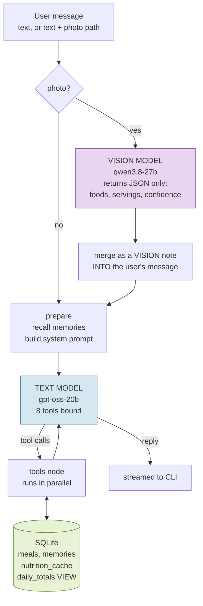
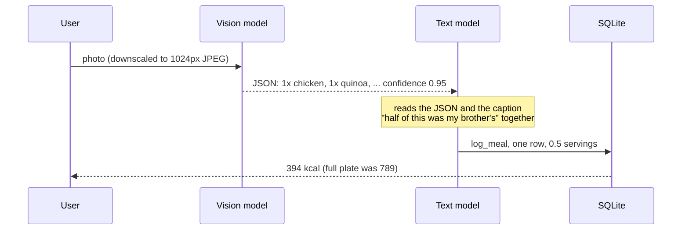
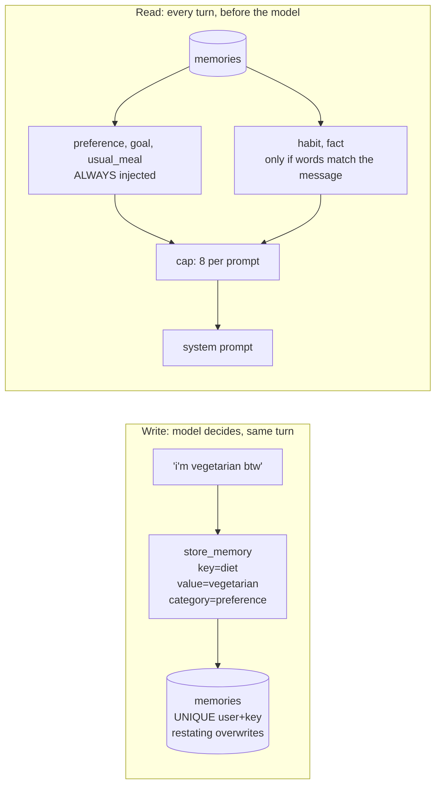
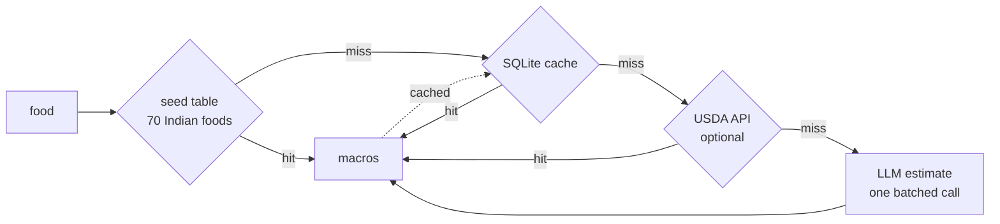

# CalorAI Agent

[](https://github.com/Parthjain171/CalorAI/actions/workflows/ci.yml)


A calorie tracker you use by texting, like you would text a friend. No forms.

[](https://drive.google.com/file/d/1z9W_38Dob9AtGs0zLuZ7z12TR20QV8vf/view?usp=sharing)

```
you:     had 2 rotis and dal for lunch
calorai: Got it, 2 rotis and dal for lunch, 370 kcal. Total today 370.

you:     actually that was 3 rotis not 2
calorai: All set, 3 rotis and dal, 480 kcal. Total today 480.

you:     how much protein have I had?
calorai: 18 g so far today.
```

The second message edits the existing row. The day shows 480, not 370 + 480.

| | |
|---|---|
| Agent | LangGraph, 8 tools, one tool per state transition |
| Models | Two on purpose: `gpt-oss-20b` for chat and tools, `qwen3.8-27b` for photos |
| Storage | SQLite. Totals are a SQL view, so they can never drift |
| Memory | Durable facts, tiered, capped at 8 per prompt. Not chat history |
| Verified | All 11 required conversations pass against a live model, asserted on the database |
| Latency | Text turn p50 1.77 s, image turn 4.4 s, measured and attributed |
| Tests | 38 unit tests, 11 case eval, a sabotage check, CI on every push |

---

## Contents

[Setup](#setup) | [Architecture](#architecture) | [Model choices](#model-choices) | [Memory](#memory-design) | [Tools](#tool-design) | [Latency](#latency) | [Test cases](#test-cases) | [Trade-offs](#assumptions-and-trade-offs) | [Time](#time-breakdown) | [Next](#what-id-build-next) | [AI tools](#ai-tools-used)

---

## Setup

```bash
git clone https://github.com/Parthjain171/CalorAI.git
cd CalorAI
python -m venv .venv
source .venv/bin/activate        # Windows: .venv\Scripts\activate
pip install -r requirements.txt
cp .env.example .env             # Windows: copy .env.example .env
```

Put a free Groq key in `.env` (create one at [console.groq.com/keys](https://console.groq.com/keys)):

```ini
OPENAI_API_KEY=gsk_...
OPENAI_BASE_URL=https://api.groq.com/openai/v1
TEXT_MODEL=openai/gpt-oss-20b
VISION_MODEL=qwen/qwen3.8-27b
```

Run:

```bash
python cli.py                                     # chat
python cli.py --image assets/plate.jpg -m "half was my brother's"
python demo.py                                    # all 11 cases, DB shown after each turn
pytest && python eval/eval_runner.py              # tests and eval
```

Other providers work by editing `.env` only. `.env.example` has a block for each.

| Provider | Free | Status |
|---|---|---|
| Groq | Yes | Verified end to end. All numbers in this README |
| Google Gemini | Yes | Wired. Google blocked the account used here (403 on every model, account side) |
| Anthropic, OpenAI | Paid | Wired |
| GitHub Models, OpenRouter, Ollama | Free or local | Same client as Groq, set `OPENAI_BASE_URL` |

No key? `CALORAI_MOCK=1` runs a scripted stand-in model. It proves the plumbing, not the model.

---

## Architecture



Three decisions that matter:

- **Totals are a SQL view.** `SUM(calories) GROUP BY user, day` on every read. No counter to keep in sync, so an edit or delete is reflected instantly and a correction cannot double count.
- **The system prompt lives in state as a string, not a message.** LangGraph's message list appends, so a new system message each turn would pile up forever.
- **Threads persist in a SQLite checkpointer.** A pending question survives a restart. Facts live in tables, the thread is only context.

---

## Model choices

| Path | Model | Why |
|---|---|---|
| Chat + tool calling | `openai/gpt-oss-20b` | Correct tool calls on every test. 0.6 s per call. Runs on 90% of turns |
| Photos | `qwen/qwen3.8-27b` | The only current Groq family that accepts images. 8 of 8 foods identified on the test photo, confidence 0.95 |
| Calorie estimates | `openai/gpt-oss-20b` | Small JSON output, rarely called (see nutrition tiers) |

**Why two models.** Chat runs on every message, so speed and cost win. Food recognition runs rarely and is hard, so quality wins. One model means paying vision prices on "how am I doing?" or accepting weak recognition. Separate models also fail separately.

**How they were chosen.** Groq's model list was pulled live and every candidate probed: three could call tools, two could see images, `gpt-oss` is text only, and `gpt-oss-120b` took 3.3 s per call. Chosen by measurement, not reputation.

**The brief suggested Claude 3.5 or GPT-4o.** Neither has a free API tier. Both are wired and one env change away.

### The photo handoff



- **Unsure** (confidence under 0.6): the note says so and the agent asks "looks like rice and dal, is that right?" instead of guessing.
- **Confidently wrong**: the reply names what was logged, so the user sees it, and the fix is the normal correction path.
- The vision model never sees the caption. Portions are scaled once, by the text model.

---

## Memory design

Not chat history. A small table of facts about the person that will still be true next month.



| Category | Example | Retrieval |
|---|---|---|
| `preference` | vegetarian, allergic to peanuts | always |
| `goal` | 140 g protein per day | always |
| `usual_meal` | usual breakfast = 2 idli and sambar | always |
| `habit` | skips lunch on weekdays | keyword match |
| `fact` | anything else durable | keyword match |

**Stored:** diets, goals, what "my usual" means, standing habits.
**Never stored:** meals (those are rows in `meals`), moods, one-off remarks.

**Bloat control, three layers:** selective writes (five categories, the tool description says what not to keep), keyed upsert (saying it ten times makes one row), a hard cap of 8 per prompt.

**Limitation:** matching is by words, not meaning. The always-on tiers keep this from mattering for the facts that matter. Embeddings are the obvious upgrade.

---

## Tool design

One tool per state transition. Reads separate from writes. No overlap.

| Tool | Does | Boundary |
|---|---|---|
| `lookup_nutrition` | macros for a **list** of foods, scaled by servings | read only |
| `log_meal` | insert a new meal | new food only |
| `get_meals` | find meals by day or name | the only way to get an id |
| `update_meal` | edit a meal in place | the only path for corrections |
| `delete_meal` | remove a meal | corrections go to update |
| `get_daily_totals` | one day's totals | reads the view, never estimates |
| `store_memory` | save a durable fact | never meals |
| `recall_memory` | read facts | read only |

- `log_meal` and `update_meal` are separate because merging them is how double counting happens.
- `lookup_nutrition` takes a list so "2 parathas and chai" is one call, not two.
- `log_meal` returns the day's totals, saving a round trip on the most common reply.
- The user id is never a tool argument. It travels in a context variable, so the model cannot pick whose data it touches.

### Where calories come from



Cheapest first. A food is priced once, ever. Compound mentions like "2 idli and sambar" are split and summed. Values are approximate by design; the brief says nutrition accuracy is not what is being evaluated.

---

## Latency

Real models, Groq free tier. Reproduce with `python eval/eval_runner.py --pace 50`.

| Span | n | p50 | p95 | note |
|---|---|---|---|---|
| model call | 30 | **0.66 s** | 13.8 s | 0.4 to 0.8 s when not throttled |
| text turn | 10 | **1.77 s** | 26.5 s | target 3 s |
| image turn | 2 | **4.4 s** | | target 6 s. First ever call 14.7 s (provider warm up) |
| harness only | 100 | 0.03 s | 0.05 s | the graph is 2% of the budget |

**The p95 is the free tier, not the model.** Groq allows 8,000 tokens per minute per model (read from `x-ratelimit-limit-tokens`). A turn arriving inside the same minute as the last one gets a 429 and the SDK's 15 to 24 s wait is what gets recorded. On a paid tier the tail disappears and the p50 does not change. There is also a 200,000 token daily cap per model; `.env.example` documents the fallback.

### What was optimised

The first real run was bad: turns of 15, 98, 21, 24, 89 s. Attribution found every call carrying 2,800 tokens of fixed prompt plus the whole thread replayed. Fixed in order of impact:

| Change | Effect |
|---|---|
| Bound history the model sees to 2,000 tokens (full thread stays in the checkpointer) | stops calls growing turn by turn |
| System prompt 802 to 426 tokens, tool schemas 1,997 to 1,541 | 30% off every call |
| `reasoning_effort=low` on reasoning models | no hidden thinking on "which tool" |
| Warm model clients at startup | first turn 13.8 s to 2.9 s. The lazy SDK import was inside the first turn |
| Downscale photos to 1024 px JPEG | 596 KB to 78 KB upload |
| Batched lookups, cached nutrition, totals folded into `log_meal`, streaming | fewer round trips |

Every graph node is timed as its own span, so an unexplained gap has to land under a name. That is how the warm-up cost was found.

### Still slow, and why

- The free tier throttle. Only money or another provider fixes it.
- The vision hop is serial by design. The text model cannot log what it has not seen.
- Corrections take 4 round trips (find, re-price, update, reply). Merging find and update would blur the log versus update line. Deliberately not done.

---

## Test cases

All 11 pass against the scripted double in CI and against **live models** with a real plate photo. Every check reads the database, never the wording.

| # | Message | Asserted |
|---|---|---|
| 1 | had 2 parathas and chai for breakfast | 1 row, breakfast, macros > 0 |
| 2 | leftover biryani, maybe two thirds of the box | 1 row, fractional calories |
| 3 | skipped lunch but grazed all afternoon | 0 rows, reply asks |
| 4 | same as yesterday | today matches yesterday |
| 5 | actually that was 3 rotis not 2 | **1 row**, total not doubled |
| 6 | how much protein have I had today? | reply quotes the DB number |
| 7 | how am I doing on calories? | reply quotes the DB number |
| 8 | photo | 1 row, source vision |
| 9 | photo + half of this was my brother's | **1 row**, under 75% of the uncaptioned plate |
| 10 | my usual | 1 row matching stored memory |
| 11 | i'm vegetarian btw | memory stored, 0 rows |

| Layer | Command | Proves |
|---|---|---|
| 38 unit tests | `pytest` | data layer, nutrition, memory, validation, graph flows |
| 11 case eval | `python eval/eval_runner.py` | the conversations, on DB state |
| Sabotage check | `python eval/test_eval_detects_regressions.py` | the eval can fail: breaks the correction and photo paths, asserts red |
| Demo | `python demo.py` | all 11 top to bottom with seeded history |
| CI | GitHub Actions | all of the above, Python 3.11 and 3.12, no keys |

### Bugs the tests found

The mock passed 11/11 for hours. The first live run still found four. Each became a fix and a test.

| Found by | Bug | Fix |
|---|---|---|
| eval x6 | parallel tool calls on one SQLite connection dropped a meal, 1 run in 20 | lock around DB access |
| eval case 9 | vision note as a separate message hid the caption; half plate logged full | merge note into the user message |
| clean clone audit | "99999 rotis" wrote 11 million kcal silently | reject implausible values |
| live model | invented an `ask_question` tool | prompt fix, one retry with a nudge |
| live model | "2 idli and sambar" priced as one bowl of sambar | split compound mentions |
| live model | empty reply mid task | one retry with a nudge |
| live model | replay written onto yesterday's date | sharper `meal_date` description |
| real photo | vision model applied the portion, text model would too | vision never sees the caption |
| timing every node | 11 s in the first turn that was in no model call | warm clients at startup |

---

## Assumptions and trade-offs

| Chose | Gave up |
|---|---|
| SQLite | nothing at this scale. Data layer is one module, Postgres is a contained change |
| Seed table before any LLM call | coverage. An unknown food costs one extra call, once |
| Separate `log_meal` and `update_meal` | one round trip on corrections, to make double counting structurally hard |
| Keyword memory recall | semantic recall. Embeddings next |
| Model-driven memory writes | recall of obliquely stated facts |
| Vision then text, serial | 2 to 4 s on image turns, for better recognition and isolated failures |
| Scripted double for offline tests | it proves plumbing only, and says so |
| Groq free tier | the throttling tail in the p95 |

Assumptions: one user per CLI session with no auth; a day is the local calendar day (`CALORAI_TZ_OFFSET_HOURS`); calorie values are trend accurate, not lab accurate; India-first food vocabulary.

---

## Time breakdown

| Phase | Hours |
|---|---|
| Setup, schema, data layer | 1.0 |
| Tools, seed table, LangGraph agent, scripted double | 2.0 |
| Totals, corrections, memory, vision | 2.4 |
| CLI, streaming, latency instrumentation | 0.8 |
| Eval, sabotage check, README | 1.5 |
| Debugging the two silent bugs | 0.6 |
| Audit from a clean clone, 7 defects fixed | 0.8 |
| Free provider support, Gemini blocked, Groq probed | 0.9 |
| Checkpointer, USDA tier, demo, unit tests, CI | 1.2 |
| Live model verification, latency attribution, 5 bugs fixed | 1.5 |
| **Total** | **12.7** |

**Over the 8 hour budget, on purpose.** Core, eval and README were done at 8.3. Stopping there would have meant submitting an agent that had never made a real tool call. The extra hours found five bugs a mock could not. Same call again.

---

## What I'd build next

1. **Indian food database** (IFCT) behind the same nutrition tier. USDA covers Indian staples thinly.
2. **Embedding recall** for memory, keeping the tiers and the cap.
3. **Pending-confirmation state** for low confidence photos, so an unanswered question never leaves a meal unlogged.
4. **Portion learning** from repeated corrections.
5. **LangSmith tracing.** Env hooks are in `.env.example`.
6. **WhatsApp transport.** The agent interface is already transport agnostic.

---

## AI tools used

An **AI coding assistant** as the pair programmer for essentially the whole build: scaffolding, schema, LangGraph wiring, the seed table, tests, and this README.

Where it helped most: volume with structure (70 seed foods, 8 tool docstrings, 38 tests), and debugging from evidence rather than guessing.

Where it was wrong, kept honestly: it blamed a write retry for corrupted log lines (real cause: unlocked appends from worker threads), and it blamed OneDrive for an 11 second gap (real cause: SDK import inside the first turn). Both were caught by measuring instead of theorising, and both are recorded above.

The judgement calls were mine: the tool boundaries, the memory tiers, refusing to merge log and update, and verifying against a real model past the time budget.
